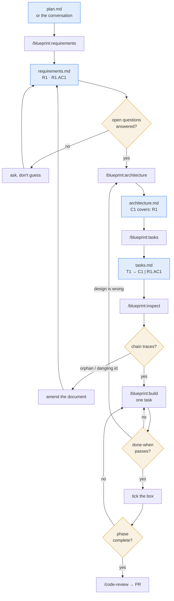

# Blueprint

Runs an agent through the SDLC in the order the SDLC actually goes, and keeps
the STLC bolted to it. Requirements before design, design before tasks, tasks
before code — and a traceability matrix that proves nothing fell out between
the phases.

## Philosophy

An agent handed a plan will write code. That skips requirements analysis and
design, so nobody can answer the two questions that matter six weeks later:
*why does this code exist*, and *what proves it works*. Blueprint refuses to
skip. Six rules do the refusing.

**One artifact in, one artifact out.** Each phase reads the previous phase's
document and nothing else. `/blueprint:architecture` designs from
`requirements.md`, not from the chat that produced it. If a constraint only
ever lived in conversation, it does not exist — which is the point, because
that is exactly the constraint that gets silently dropped.

**Phase gates are real.** Unanswered open questions stop the next phase from
starting. An agent that guesses at an ambiguity during requirements analysis
propagates that guess through design and tasks, and it surfaces as rework
after the code is written. Cheapest place to be wrong is the first document.

**Requirements describe behavior, not implementation.** No class names, no
libraries, no file paths in `requirements.md`. The plan will say "add a Redis
cache"; the requirement is "repeat lookups SHALL complete in under 50ms".
Record the need, and let design answer it.

**Shift the test basis left.** Acceptance criteria are written in EARS during
requirements analysis, before any design exists — which makes them the test
basis, not a retrofit. `WHEN the token is expired THEN the system SHALL
refresh silently` is already a test case. There is no "write the tests" phase
at the end, because the task that satisfies a criterion is the task that
asserts it.

**Traceability runs both ways.** Forward: every requirement reaches a
component, every criterion reaches a task. Backward: every line of code
traces to a task, to a component, to a criterion, to a requirement. This is
what makes `/blueprint:build` able to make a *focused* change — it loads one
component and two criteria instead of the whole spec, so the diff stays small
enough that review is real.

**Verification is a command, not an opinion.** A box gets ticked when a
`done-when` check exits zero. And when implementation proves the design
wrong, the agent stops and amends the document rather than quietly diverging
— a spec that no longer describes the code is worse than no spec, because
people still trust it.

## Flow



## Phases

| SDLC / STLC phase | Command | Artifact |
|---|---|---|
| Requirements analysis + test basis | `/blueprint:requirements [slug]` | `requirements.md` — `R1`, EARS criteria `R1.AC1`, explicit out-of-scope, open questions it refuses to guess at |
| System design | `/blueprint:architecture [slug]` | `architecture.md` — components `C1` with real interfaces, each declaring `covers: R1, R2` |
| Work breakdown + test design | `/blueprint:tasks [slug]` | `tasks.md` — commit-sized `T1 → C1 \| R1.AC1`, each with a runnable `done-when` |
| Traceability review | `/blueprint:inspect [slug]` | Report — orphan requirements, uncovered criteria, dangling ids. Read-only |
| Implementation + test execution | `/blueprint:build [slug\|T<n>]` | Code, passing check, ticked box; `/code-review` and a PR at phase close |

Artifacts live in `.blueprint/<feature-slug>/`, in the repo, so the spec
reviews in the same pull request as the code it produced.

Markdown is the only source of truth. Machine-readability comes from stable
ids (`R1`, `R1.AC2`, `C3`, `T7`), not a parallel data file that drifts.
`FORMAT.md` is the contract all five skills read.

## Compared to other approaches

Blueprint is not a new idea. The three-document shape and EARS acceptance
criteria come straight from Kiro's spec mode; the phase discipline is just
the SDLC. What Blueprint adds is the id layer and a validator that enforces
it, so traceability is checked rather than merely intended.

| | Artifacts | Traceability | Test basis | Execution unit |
|---|---|---|---|---|
| **Plan mode** (built-in) | ephemeral, in-context | none | none | the whole plan |
| **Spec Kit** | spec / plan / tasks files | by convention | in the spec | implement step |
| **Kiro specs** | requirements / design / tasks | by convention | EARS in requirements | per task |
| **BMAD** | story files per agent role | scoped to a story | criteria in the story | per story |
| **Task runners** (PRD → tasks) | task list, often JSON | task ↔ PRD | none inherent | per task |
| **Blueprint** | 3 markdown files + stable ids | **validated** by `/blueprint:inspect` | EARS, cited by every task | one task, one passing check |

The honest summary: if your specs are short-lived and you read every diff
anyway, convention is enough and the id layer is overhead. The ids start
paying when a feature outlives one session — when someone asks why `C4`
exists, or whether dropping `R2` orphaned anything, and the answer is a grep
instead of a re-read.

*Comparison is by shape, not feature checklist. These tools move fast — check
their current docs before quoting this table.*

## Install

```
/plugin marketplace add adezdev/blueprint
/plugin install blueprint@blueprint
```

From a local clone, point the first command at the directory instead:

```
/plugin marketplace add /path/to/blueprint
/plugin install blueprint@blueprint
```

Then start a feature — the conversation itself can be the plan:

```
/blueprint:requirements token-refresh
```
