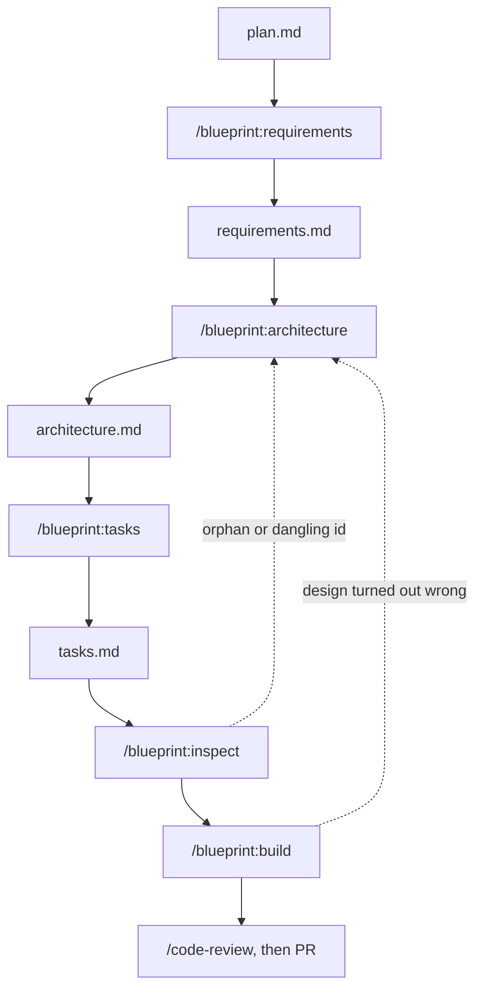

# Blueprint

Five Claude Code skills that walk a feature through the SDLC in order:
requirements, architecture, tasks, then code. Every task cites the component
and acceptance criterion it exists for, so you can check nothing got dropped
between the phases.

## Why

- An agent handed a plan writes code immediately. Six weeks later nobody can
  say why a file exists or what proves it works.
- Each phase reads the previous document and nothing else. Architecture
  designs from `requirements.md`, not from the chat.
- Unanswered open questions block the next phase. Guessing early is what
  causes the expensive rework later.
- Acceptance criteria are written in EARS up front, so they double as test
  cases. No "write the tests" phase at the end.
- `/blueprint:build` loads one component and its criteria instead of the
  whole spec. That's what keeps the diff reviewable.
- A box gets ticked when a command exits zero, not when the code looks right.

## Flow



## Commands

| Command | Reads | Writes |
|---|---|---|
| `/blueprint:requirements [slug]` | `plan.md`, or the conversation | `requirements.md` — `R1`, EARS criteria `R1.AC1`, out-of-scope, open questions |
| `/blueprint:architecture [slug]` | `requirements.md` | `architecture.md` — components `C1` with real interfaces and `covers: R1, R2` |
| `/blueprint:tasks [slug]` | `architecture.md` | `tasks.md` — `T1 → C1`, citing criteria, each with a runnable `done-when` |
| `/blueprint:inspect [slug]` | all three | nothing — reports orphans, uncovered criteria, dangling ids |
| `/blueprint:build [slug\|T<n>]` | one task's component + criteria | code, a passing check, a ticked box |

## Files

```
.blueprint/<feature-slug>/
  plan.md            optional — the conversation can be the plan
  requirements.md
  architecture.md
  tasks.md
```

In the repo, so the spec reviews in the same PR as the code. Markdown is the
only source of truth — machine-readability comes from stable ids (`R1`,
`R1.AC2`, `C3`, `T7`), not a parallel JSON file that drifts. `FORMAT.md` is
the contract all five skills read.

## Prior art

The three-document shape and EARS criteria are lifted from Kiro's spec mode.
The addition here is stable ids and a validator that checks them.

| | Artifacts | Traceability | Test basis | Unit of work |
|---|---|---|---|---|
| Plan mode | in-context, gone after | none | none | whole plan |
| Spec Kit | spec / plan / tasks | convention | in the spec | implement step |
| Kiro specs | requirements / design / tasks | convention | EARS | task |
| BMAD | story files per role | per story | in the story | story |
| PRD → task runners | task list, often JSON | task ↔ PRD | none | task |
| Blueprint | 3 files + ids | checked by `inspect` | EARS, cited per task | one task, one check |

If your specs live for one session and you read every diff, convention is
enough and the ids are overhead. They pay off when someone asks why `C4`
exists, or whether dropping `R2` orphaned anything — grep instead of re-read.

*Compared by shape, not feature-by-feature. Check their docs before quoting
this.*

## Install

```
/plugin marketplace add adezdev/blueprint
/plugin install blueprint@blueprint
```

From a local clone, point the first command at the directory instead.

```
/blueprint:requirements token-refresh
```

## Contributing

Turn on the hooks once per clone:

```
git config core.hooksPath .githooks
```

`commit-msg` enforces Conventional Commits. `pre-commit` blocks a change to
`skills/`, `FORMAT.md` or `.claude-plugin/` that forgets `CHANGELOG.md`. CI
checks the manifests parse and that every skill still loads.

## License

MIT. See [CHANGELOG.md](CHANGELOG.md) for what changed when.
